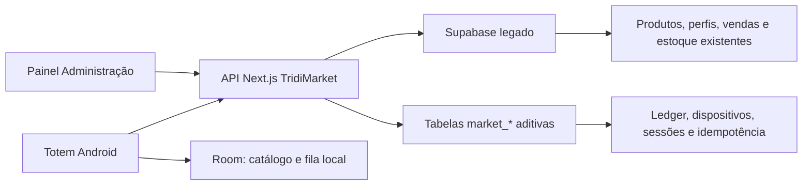

# TridiMarket

O TridiMarket é o mercadinho interno da Tridi. O esboço funcional inclui o
painel de gestão dentro de **Administração** e um app Android de totem para
tablet, com catálogo local e fila de sincronização.

## O que foi incluído

- Visão geral com consumo, recebimento, saldo em aberto, atrasos e estoque.
- Funcionários com limite individual, disponibilidade, situação e troca de PIN.
- Produtos, preço por perfil, estoque mínimo e histórico de preço.
- Ajustes de estoque com motivo e trilha de auditoria.
- Pagamentos por Pix, dinheiro, cartão, transferência ou outro método.
- Dispositivos com código de ativação temporário, revogação e saúde.
- Livro-razão imutável e operação de compra idempotente por UUID.
- App Android com ativação, PIN, catálogo, carrinho, confirmação e fila Room.
- Catálogo inspirado no app comercial de referência: categorias rápidas, cards
  em duas colunas com fotografia dominante e barra persistente do carrinho.
- Busca exclusivamente pelo nome do produto. Não há leitura nem pesquisa por
  código de barras no totem.
- Todo toque em produto abre uma confirmação com foto, nome, preço e estoque;
  o item só entra no carrinho depois de confirmar.
- Imagens remotas com cache e ilustração local de fallback, mantendo o catálogo
  utilizável quando o tablet estiver offline.
- Token do dispositivo protegido pelo Android Keystore.
- Sessão offline protegida por PBKDF2 e limitada a 48 horas.
- Inicialização após boot, HOME persistente e Android LockTask quando o app é
  configurado como Device Owner.

O modelo usa uma carteira interna com pagamento direto registrado. Não existe
integração com folha de pagamento.

## Arquitetura



O navegador e o APK nunca recebem a chave `service_role`. A variável histórica
`TRIDIMARKET_SUPABASE_ANONKEY` contém uma chave privilegiada e deve continuar
somente no servidor.

## Ativar a estrutura no banco

O código funciona em modo de compatibilidade com os cadastros legados. Para
liberar ledger, PINs, dispositivos e sincronização, execute
[`supabase/tridimarket.sql`](../supabase/tridimarket.sql) no SQL Editor do projeto
Supabase `wcxhyludixozqloqzjpn`.

A migração é aditiva e idempotente: não remove nem reescreve vendas antigas.
Depois, publique o Next.js com a variável de servidor:

```bash
TRIDIMARKET_SUPABASE_ANONKEY=<service-role existente>
```

## Fluxo de ativação do tablet

1. Abra **Administração → TridiMarket → Dispositivos**.
2. Selecione a unidade e use o nome `Mesa Carimbos`.
3. Gere o código de seis dígitos, válido por 24 horas.
4. Instale e abra o APK no tablet.
5. Digite o código. O tablet recebe um token próprio, que pode ser revogado no painel.
6. Em **Funcionários**, cadastre um PIN de quatro a seis dígitos para cada pessoa.

## Compilar e instalar

```bash
cd tridimarket-app
./gradlew testDebugUnitTest assembleDebug
adb install -r app/build/outputs/apk/debug/app-debug.apk
```

APK de desenvolvimento:

```text
tridimarket-app/app/build/outputs/apk/debug/app-debug.apk
```

## Kiosk e abertura automática

Para Device Owner, o Android exige um aparelho restaurado, sem contas e ainda
sem outro proprietário configurado. Depois de instalar o APK:

```bash
adb shell dpm set-device-owner com.tridi.market/.kiosk.MarketAdminReceiver
adb shell am start -n com.tridi.market/.MainActivity
```

Ao ser promovido a Device Owner, o receiver:

- libera o pacote no LockTask;
- registra o TridiMarket como HOME persistente;
- remove a navegação do sistema enquanto o app está aberto;
- volta a abrir o app após reinicialização.

Para conferir o estado:

```bash
adb shell dumpsys device_policy
adb shell dumpsys activity activities | grep com.tridi.market
```

## Desenvolvimento no emulador

```bash
$ANDROID_HOME/emulator/emulator -avd Medium_Tablet
adb install -r tridimarket-app/app/build/outputs/apk/debug/app-debug.apk
adb shell am start -n com.tridi.market/.MainActivity
```

Enquanto a migração/API ainda não estiver publicada, o APK `debug` pode abrir
o fluxo local de demonstração. O mesmo parâmetro é ignorado em release. Para
abrir a tela de descanso ou começar no login, use o PIN `2458`:

```bash
adb shell am force-stop com.tridi.market
adb shell am start -n com.tridi.market/.MainActivity --es tridimarket_preview welcome

adb shell am force-stop com.tridi.market
adb shell am start -n com.tridi.market/.MainActivity --es tridimarket_preview pin
```

Também estão disponíveis os atalhos `catalog` e `receipt` para validar essas
telas isoladamente.

O esboço foi compilado e aberto no AVD `Medium_Tablet`, em 2560 × 1600.
O fluxo de catálogo, confirmação, carrinho e recibo foi executado de ponta a
ponta no emulador. Para evitar sobrecarga do renderizador em tablets modestos,
as fotos entram sem animação de transição.

### Recuperar o AVD de ANRs do sistema

Um aviso “TridiMarket isn't responding” pode ser causado pelo próprio Android,
antes de qualquer código do app. No AVD `Medium_Tablet`, o relatório de
23/07/2026 registrou a thread principal bloqueada em
`ActivityThread.handleBindApplication → ConnectivityManager.getDefaultProxy`,
junto com ANRs de Google Play Services, telefone e Pixel Launcher.

Quando mais de um app do sistema apresenta o mesmo aviso, faça um cold boot sem
apagar o armazenamento:

```bash
adb emu kill
$ANDROID_HOME/emulator/emulator @Medium_Tablet -no-snapshot-load -no-snapshot-save
```

Depois do cold boot, reinstale sempre com `adb install -r`; não use
`adb uninstall` nem `pm clear`, pois esses comandos removem o pareamento.
No diagnóstico de 23/07, três partidas frias consecutivas abriram sem novo ANR
ou exceção. O emulador estava usando renderização de software por pressão de
memória do macOS, portanto os tempos do AVD não representam um tablet físico.

## Verificação

Web:

```bash
npm test
npx tsc --noEmit
npm run build
```

Android:

```bash
cd tridimarket-app
./gradlew testDebugUnitTest assembleDebug
```

## Estado de implantação

O código, os testes, a migração e o APK estão prontos no branch de trabalho. A
migração SQL não é aplicada automaticamente por uma chave `service_role`; ela
exige SQL Editor, senha do banco ou credencial da Supabase CLI. Enquanto isso,
o painel mostra os dados legados e um aviso claro de ativação pendente. Em
23/07/2026, a tentativa de criar o código `Mesa Carimbos` retornou HTTP 404
para `market_device_codes`, confirmando que a migração ainda não está publicada
no projeto `wcxhyludixozqloqzjpn`.
